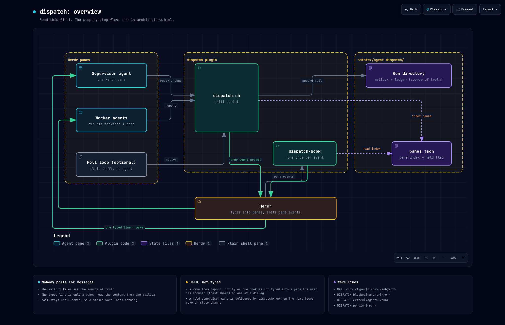

# dispatch

Supervise coding agents in [Herdr](https://herdr.dev) without polling them.

A supervisor agent hands work to worker agents, each in its own git worktree. When a worker finishes, has a question or gets stuck, the supervisor is woken by one line typed into its pane. Nothing in the supervisor waits, so there is no watcher to time out and re-arm, and it stays free while workers run.

Herdr gives you `agent prompt` and `agent wait`. This adds what long-running, parallel work needs on top of them: a durable mailbox with typed and acked messages, a ledger of attempts with retries and dependencies, and a lifecycle around each worker.

It builds on three things in the Herdr server: a delivery queue that types a line into a pane only when that is safe, supervision links that report a blocked, stalled or gone worker, and jobs that run a command with no pane. Those are in the [mago0/herdr](https://github.com/mago0/herdr) fork. On a Herdr without them, use this plugin at commit `1dde74a`, version 0.1.0, which carries its own event hook.



## Why not just `herdr agent prompt --wait`?

For a short exchange with an agent beside you, use it. It is simpler. It stops fitting when the work is supervised, long-running or parallel:

- **No watcher to re-arm.** A wait runs inside the supervisor's harness, and harnesses kill long tasks. Here the sender wakes the supervisor, so nothing in it is waiting.
- **The supervisor stays free.** No blocking wait and no idle token cost. One supervisor can hold many workers and hear from them in any order.
- **Real messages, not screen scraping.** Workers send typed mail (`status`, `question`, `escalation`, `worker_done` with an outcome). A wait only says an agent stopped, and reading its terminal can lose output.
- **Durable and acked.** Mail stays until it is acknowledged, so it survives a restart, a context compaction or a missed wake. Herdr events are not replayed.
- **It does not corrupt a half-typed prompt.** `herdr agent prompt` appends to whatever is in the input box and submits it. A wake goes through Herdr's delivery queue: it is held while the target pane is focused or at a dialog, you get a toast, and Herdr types it when you move away.
- **Blocked, stalled and dead workers are reported at once**, with the text of the dialog a blocked worker shows.
- **A lifecycle around each worker.** A worktree per task, a ledger of attempts, retries, dependencies, and an explicit keep or release decision at the end.
- **External polls move out of the harness.** A command that watches a chat thread or a pull request runs as a Herdr job, with no pane and no time limit, and wakes an agent only when something changed.

If you have used Orca's orchestration, this is that model for Herdr: runs, typed and acked messages, and a fleet view, with wakes delivered by push.

## What it looks like

The supervisor agent binds a run and starts a worker. In practice the agent runs these from `skill/SKILL.md`; you ask it to "dispatch" something.

```sh
dispatch.sh run --name fix-probes
dispatch.sh start --repo ~/src/api --branch claude/fix-probe-timeouts --name probes --task task.md
```

The worker opens in its own worktree and pane, with instructions on how to report. The supervisor goes back to whatever it was doing. Later this line is typed into its pane:

```
MAIL|msg_1791236483_162548|worker_done|probes|probe timeouts fixed, PR opened - handle it: dispatch.sh read --run fix-probes --id msg_1791236483_162548
```

The line is only a wake. The supervisor reads the message from the mailbox, checks the work, and settles it:

```sh
dispatch.sh read --id msg_1791236483_162548
dispatch.sh ack  --id msg_1791236483_162548 --decision release    # or retain, or reuse
```

Other lines it can receive:

| Line | Meaning |
|---|---|
| `MAIL\|<id>\|<type>\|<from>\|<subject>` | a worker reported; `question` gets `dispatch.sh reply` |
| `HERDR\|blocked\|<agent>\|<pane>\|<what it shows>` | a worker stopped at a permission dialog or question |
| `HERDR\|stalled\|<agent>\|<pane>\|<seconds>` | a worker reports working and its screen does not change |
| `HERDR\|exited\|<agent>\|<pane>` | a worker's agent or pane went away before it reported `worker_done` |

The `HERDR` lines come from the server, through the supervision link that `dispatch.sh start` makes.

`dispatch.sh ps` shows every attempt with its liveness and the next command to run.

## Install

```sh
herdr plugin install mago0/herdr-plugins/dispatch
root="$(herdr plugin list --plugin dispatch --json | jq -r '.result.plugins[0].plugin_root')"
ln -s "$root/skill" ~/.claude/skills/dispatch   # or your agent's skills directory
```

Keep the skill symlinked to the installed plugin and do not copy it, so that the skill text and the scripts stay the same version.

Requirements:

- A Herdr server with `agent deliver`, `pane supervise` and `job` ([mago0/herdr](https://github.com/mago0/herdr), branch `orchestration` or later)
- `bash`, `jq`, `flock`, `git`; `inotifywait` for an event-driven `dispatch.sh wait` (falls back to polling)

`dispatch.sh adopt` links the live workers of runs that an older version started, so that they show under their supervisor.

## Row labels

Herdr shows a label at the right edge of an agent's row in the sidebar tree. `dispatch.sh start --label SRE-142` sets it on the worker, and `dispatch.sh run --label SRE-142` on the supervisor. A name or a run name that starts with an issue key is split: `sre-142-fix-probes` gives the label `SRE-142` and the agent name `fix-probes`.

## Waking an agent from outside

Chat threads and pull requests cannot push to your machine, so something has to poll them. Give that command to Herdr as a job, and let it wake the agent only when there is news:

```sh
herdr job add pr-watch --every 60s --to lead -- ./pr-news.sh     # exit 0 with text = news, delivered to lead
herdr job add proposals --path proposals.json --to lead -- ./warranted.sh
herdr agent deliver lead "PR 123 has a new push"                 # one line, from any process
```

The same news is not delivered twice in a row, so the command needs no bookkeeping. A job ends when its target pane or the pane that added it closes.

## Limits

- `stalled` finds a frozen agent. An agent that still animates while it waits on a tool that never returns is not found.
- Wake delivery was tested with Claude Code. Other agent kinds queue typed input in their own way.
- Herdr events are kept in memory. `herdr events read` reports `lost` for a cursor that is too old or from before a restart, and `dispatch.sh ps` is the reconcile path.

## How it is built

A skill (`skill/`): `SKILL.md`, the reference agents read, and the scripts they run. `dispatch.sh` holds runs, the ledger, the mailbox and the fleet view. Herdr holds the supervision links, the held wake lines and the jobs.

State is under `${XDG_STATE_HOME:-~/.local/state}/agent-dispatch/`:

- `runs/<run>/ledger.json`: dispatch attempts
- `runs/<run>/inbox.jsonl`: worker to supervisor mail
- `runs/<run>/workers/<agent>/inbox.jsonl`: supervisor to worker mail
- `runs/<run>/supervisor`: the pane that gets the run's wake lines

Diagrams of version 0.1.0, as standalone HTML to open locally: `docs/overview.html` and `docs/architecture.html`. They still show the event hook, which Herdr replaced.

## Test

```sh
test/smoke.sh
```

Runs every `dispatch.sh` command that needs no live agent against a throwaway state directory. It needs a running Herdr server with delivery queues.
